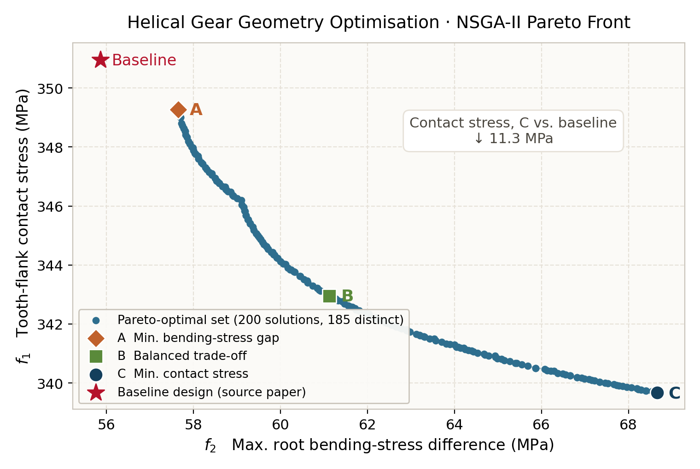
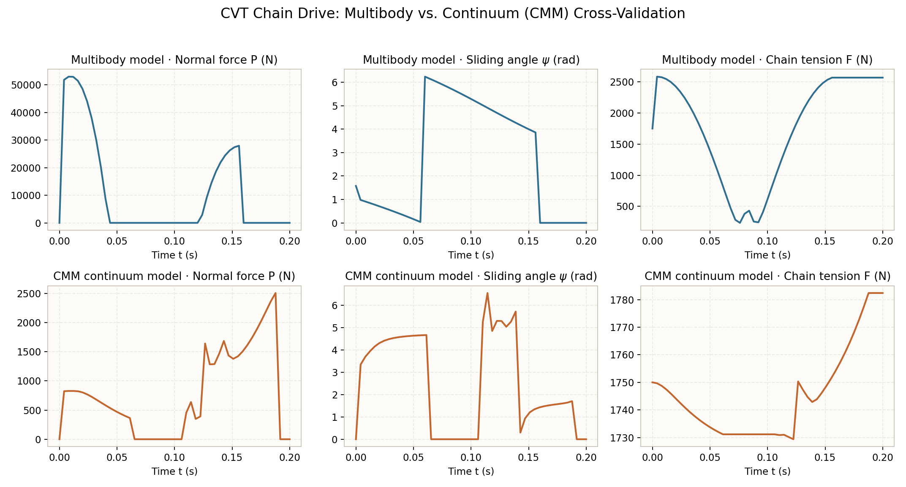
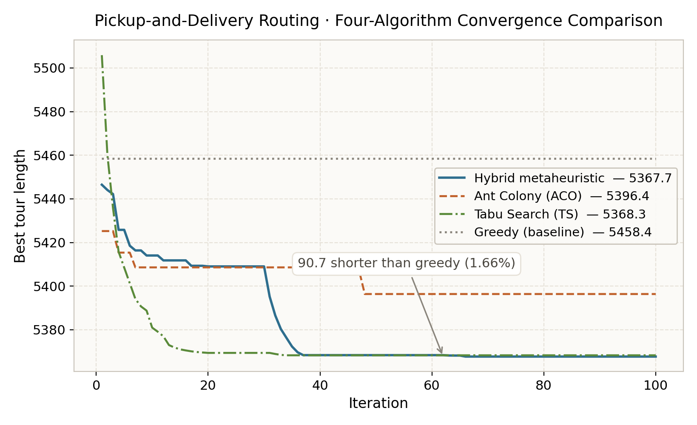

# Engineering Simulation & Optimisation — Selected Work

MATLAB models built for mechanical design, multibody dynamics and combinatorial
optimisation problems. Each folder is self-contained: clone, open in MATLAB, run
the entry-point script.

| | Project | Domain | Entry point |
|---|---|---|---|
| 01 | [Helical gear geometry optimisation](01-helical-gear-nsga2) | Gear design, multi-objective optimisation | `helical_gear_nsga2.m` |
| 02 | [CVT chain drive, two-model cross-validation](02-cvt-chain-drive) | Multibody dynamics, contact mechanics | `run_comparison.m` |
| 03 | [Pickup-and-delivery routing](03-pickup-delivery-routing) | Combinatorial optimisation, metaheuristics | `pickup_delivery_routing.m` |

---

## 01 — Helical Gear Geometry Optimisation (NSGA-II)

With centre distance, face width and gear ratio fixed, solve for a geometry set
(z₁, mₙ, β, xₙ₁, xₙ₂) that lowers tooth-flank contact stress while narrowing the
root bending-stress gap between pinion and wheel. The objectives conflict, so the
result is a Pareto front rather than a single design.

**Notes on the model.** Form factors, stress-correction factors and contact ratios
are computed from closed-form approximations — no lookup tables. Centre distance is solved
through the working pressure angle, which requires inverting the involute function
numerically; a common shortcut is to use the reference pressure angle instead,
which drops the profile-shift coefficients out of the centre-distance equation
entirely and makes the constraint unsatisfiable for any shifted gear pair. Constraint
violation is ranked ahead of non-dominated sorting so infeasible individuals never
survive into the reported front.

Population 200, 800 generations, SBX crossover and polynomial mutation. The paper's
baseline design is feasible under this model and is not dominated by the front: its
bending-stress gap (55.9 MPa) is smaller than any front point, at a higher contact
stress (351.0 MPa vs. 339.7 MPa for design C).

---

## 02 — CVT Chain Drive: Multibody vs. Continuum

In a metal-chain CVT, contact forces and sliding behaviour between chain plates and
pulley sheaves govern both efficiency and wear. The same operating condition is
solved along two independent routes — one resolving each of 78 chain plates as a
body, the other treating the chain as a continuum (CMM) — and the two are compared
term by term.

**What the comparison shows.** The models agree on the phase of the sliding angle
and the trend of chain tension, but peak normal force differs by roughly 20×
(multibody 5.3×10⁴ N vs. CMM 2.5×10³ N). The multibody model resolves the impact
load as a single plate enters mesh; the continuum model smears it into a distributed
force. That gap marks where each modelling route stops being valid.

---

## 03 — Pickup-and-Delivery Routing with Pairing Constraints

37 nodes, 18 pickup–delivery pairs, 4 part types. The carrier holds one part at a
time, so every pickup must be followed directly by a delivery point of the same
type. The constraint is built into route construction and the neighbourhood moves
rather than added as a penalty term, so every candidate the search keeps is
feasible by construction.

Four algorithms run on identical data and iteration budget:

| Algorithm | Final tour length | vs. greedy |
|---|---|---|
| Hybrid metaheuristic | 5367.7 | −1.66% |
| Tabu Search | 5368.3 | −1.65% |
| Ant Colony Optimisation | 5396.4 | −1.14% |
| Greedy (baseline) | 5458.4 | — |

The hybrid and tabu results are within 0.01% of each other — on this instance the
two are effectively tied, and the honest reading is that tabu search reaches the
same quality with a simpler implementation.

---

## Requirements

MATLAB R2020a or later (`exportgraphics`). Projects 01 and 02 need no toolboxes.
Project 03 calls `pdist2` from the Statistics and Machine Learning Toolbox; a
one-line base-MATLAB replacement is given in its README and in the source. Everything has
also been verified under GNU Octave 8 with minor plotting adjustments.

## Licence

MIT — see [LICENSE](LICENSE).
